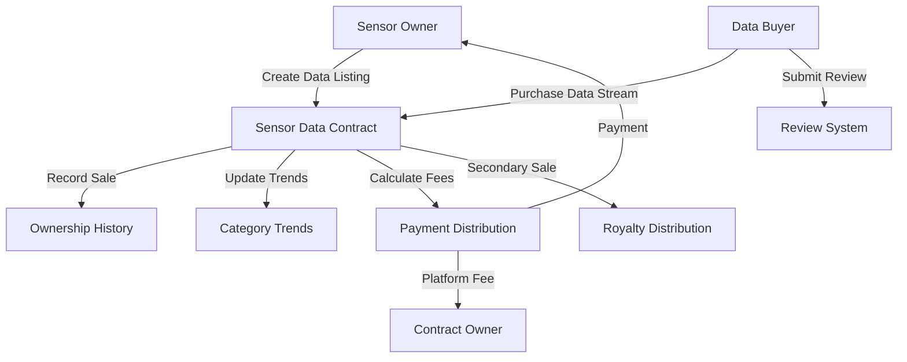

# Ring Orchestrated Sensor

A decentralized platform for sensor data management and marketplace on the Stacks blockchain, enabling secure, transparent, and efficient data exchange for IoT sensor networks.

## Overview

Ring Orchestrated Sensor is an innovative blockchain-powered platform built on Stacks that allows sensor data owners and researchers to:
- List and sell IoT sensor data streams
- Set custom pricing and royalty arrangements
- Track data market trends and popular sensor categories
- Build reputation through a quality review system
- Securely transfer sensor data ownership using STX tokens

Key features:
- Customizable data pricing and royalty structures
- Trend tracking and sensor data analytics
- Reputation and data quality review system
- Secure ownership transfer
- Secondary data market support

## Architecture

The platform is built around a single core smart contract that handles all sensor data marketplace operations:



### Core Components:
1. **Listing Management**: Creation, updating, and removal of sensor data listings
2. **Purchase System**: Secure data stream buying process with automatic fee distribution
3. **Ownership Tracking**: Historical record of data ownership
4. **Review System**: Buyer feedback and data quality rating mechanism
5. **Trend Analysis**: Purchase tracking by sensor category and time period

## Contract Documentation

### Ring Orchestrated Sensor Contract

The main contract (`sensor-orchestrator.clar`) manages all sensor data marketplace operations.

#### Key Features

- **Listing Management**
  - Create, update, and remove sensor data listings
  - Set prices and royalty percentages
  - Store sensor data metadata and access URLs

- **Purchase Processing**
  - Handle secure data transactions
  - Distribute platform fees
  - Record ownership changes
  - Update trend data

- **Review System**
  - Submit and store data quality reviews
  - Track review status
  - Limit one review per data purchase

#### Access Control
- Only data listing creators can modify their listings
- Only buyers can submit reviews for purchased data streams
- Platform fees are sent to the contract owner
- Maximum royalty percentage is capped at 15%

## Getting Started

### Prerequisites
- Clarinet
- Stacks wallet
- STX tokens for transactions

### Basic Usage

1. **Creating a Sensor Data Listing**
```clarity
(contract-call? .sensor-orchestrator create-listing 
    "Temperature Sensor Data"
    "Hourly temperature readings from urban weather station"
    u1000000 ;; Price in µSTX
    "weather"
    "preview-url"
    "full-dataset-url"
    u10 ;; 10% royalty
)
```

2. **Purchasing a Data Stream**
```clarity
(contract-call? .sensor-orchestrator purchase-asset u1)
```

3. **Submitting a Review**
```clarity
(contract-call? .sensor-orchestrator submit-review 
    u1 ;; listing-id
    u5 ;; score
    "High-quality, consistent data!"
)
```

## Function Reference (abbreviated)

### Listing Management
```clarity
(create-listing 
    (title (string-ascii 100))
    (description (string-utf8 500))
    (price uint)
    (category (string-ascii 50))
    (preview-url (string-utf8 200))
    (full-asset-url (string-utf8 200))
    (royalty-percent uint)
)
```

### Transaction Functions
```clarity
(purchase-asset (listing-id uint))
(resell-asset (listing-id uint) (new-price uint))
```

## Development

### Testing
1. Install Clarinet
2. Clone the repository
3. Run tests:
```bash
clarinet test
```

## Security Considerations

### Best Practices
- Verify data source and sensor reputation
- Check listing status before purchasing
- Review dataset details thoroughly
- Maintain sufficient STX for platform fees